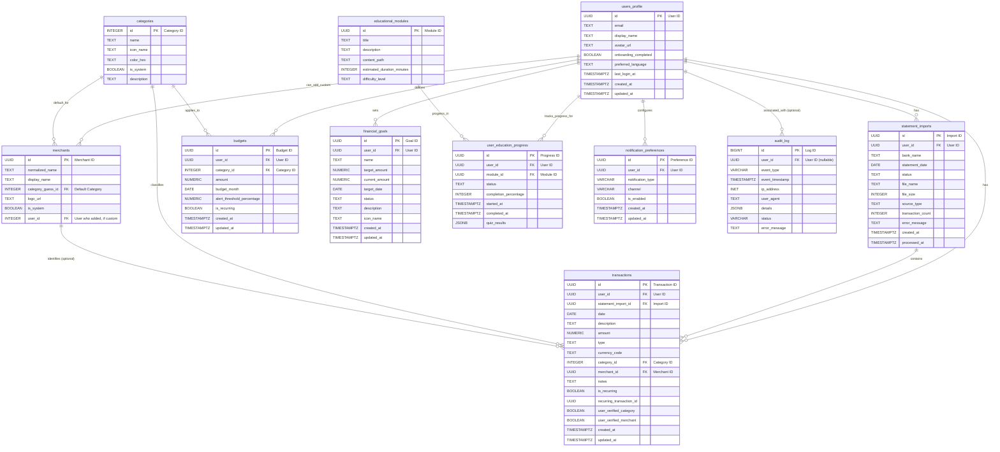

# ClariFi - Database Schema Design v1.0

This document outlines the database schema for the ClariFi application, designed for Supabase PostgreSQL.

## Table of Contents

1.  [Conventions](#conventions)
2.  [Data Model Diagram (Conceptual)](#data-model-diagram-conceptual)
3.  [Table Definitions](#table-definitions)
    *   [users_profile](#users_profile)
    *   [categories](#categories)
    *   [merchants](#merchants)
    *   [statement_imports](#statement_imports)
    *   [transactions](#transactions)
    *   [budgets](#budgets)
    *   [financial_goals](#financial_goals)
    *   [educational_modules](#educational_modules)
    *   [user_education_progress](#user_education_progress)
    *   [notification_preferences](#notification_preferences)
    *   [audit_log](#audit_log) (Optional, for critical actions)

## 1. Conventions

*   **Table Names**: `snake_case`, plural (e.g., `transactions`).
*   **Column Names**: `snake_case`.
*   **Primary Keys**: `id` (UUID, auto-generated by Supabase default or `uuid_generate_v4()`).
*   **Foreign Keys**: `[referenced_table_singular]_id` (e.g., `user_id` in `transactions` referencing `users_profile.id`).
*   **Timestamps**:
    *   `created_at`: `TIMESTAMPTZ` with default `NOW()`.
    *   `updated_at`: `TIMESTAMPTZ` with default `NOW()`. An trigger will be set up to auto-update this.
*   **Data Types**: Use standard PostgreSQL types. Default to `TEXT` for strings unless a specific length or type is critical. Use `DECIMAL` or `NUMERIC` for monetary values, not `FLOAT`.
*   **Enums**: Use PostgreSQL ENUM types where appropriate for fixed sets of values.

## 2. Data Model Diagram (Conceptual)

*Note: This is a high-level conceptual diagram. Detailed relationships and attributes are in the table definitions.*

## 3. Table Definitions

---

### `users_profile`

Stores public user profile information and application-specific settings linked to the `auth.users` table.

| Column Name        | Data Type     | Constraints                                  | Description                                                                 |
|--------------------|---------------|----------------------------------------------|-----------------------------------------------------------------------------|
| `id`               | `UUID`        | `PRIMARY KEY`, `DEFAULT auth.uid()`          | References `auth.users.id`. Automatically populated by a trigger or default. |
| `username`         | `TEXT`        | `UNIQUE`, `NULLABLE`                         | User's chosen display name. Can be null initially.                           |
| `avatar_url`       | `TEXT`        | `NULLABLE`                                   | URL to the user's avatar image.                                             |
| `first_name`       | `TEXT`        | `NULLABLE`                                   | User's first name.                                                          |
| `last_name`        | `TEXT`        | `NULLABLE`                                   | User's last name.                                                           |
| `theme_preference` | `TEXT`        | `DEFAULT 'system'`, `NULLABLE`               | User's preferred theme ('light', 'dark', 'system').                         |
| `currency_code`    | `VARCHAR(3)`  | `DEFAULT 'USD'`, `NOT NULL`                  | Default currency for the user (e.g., 'USD', 'CAD').                          |
| `language_code`    | `VARCHAR(5)`  | `DEFAULT 'en'`, `NOT NULL`                   | Default language for the user (e.g., 'en', 'fr-CA').                         |
| `onboarding_status`| `TEXT`        | `DEFAULT 'pending'`, `NULLABLE`              | Tracks user's onboarding completion ('pending', 'completed', 'skipped').     |
| `last_login_at`    | `TIMESTAMPTZ` | `NULLABLE`                                   | Timestamp of the user's last login. Updated via application logic.        |
| `created_at`       | `TIMESTAMPTZ` | `DEFAULT NOW()`, `NOT NULL`                  | Timestamp of profile creation.                                              |
| `updated_at`       | `TIMESTAMPTZ` | `DEFAULT NOW()`, `NOT NULL`                  | Timestamp of last profile update.                                           |

**Notes:**
*   The `id` column should be the same as `auth.users.id` and is the primary key.
*   RLS (Row Level Security) policies will ensure users can only access and modify their own profile.
*   Consider if `theme_preference`, `currency_code`, `language_code` should be in a separate `app_settings` table if they become more complex. For MVP, this is fine.

---

### `categories`

Stores transaction categories. Categories can be system-defined (available to all users) or user-defined (specific to a user).

| Column Name     | Data Type     | Constraints                                     | Description                                                                      |
|-----------------|---------------|-------------------------------------------------|----------------------------------------------------------------------------------|
| `id`            | `UUID`        | `PRIMARY KEY`, `DEFAULT uuid_generate_v4()`     | Unique identifier for the category.                                              |
| `user_id`       | `UUID`        | `NULLABLE`, `REFERENCES users_profile(id) ON DELETE CASCADE` | Foreign key to `users_profile`. If NULL, it's a system-defined category.        |
| `name`          | `TEXT`        | `NOT NULL`                                      | Name of the category (e.g., "Groceries", "Utilities").                          |
| `icon_name`     | `TEXT`        | `NULLABLE`                                      | Name of an icon associated with the category (e.g., from an icon library).       |
| `color`         | `VARCHAR(7)`  | `NULLABLE`                                      | Hex color code associated with the category (e.g., "#FF5733").                  |
| `parent_id`     | `UUID`        | `NULLABLE`, `REFERENCES categories(id) ON DELETE SET NULL` | For sub-categories. References `id` of the parent category in the same table. |
| `is_system`     | `BOOLEAN`     | `DEFAULT FALSE`, `NOT NULL`                     | True if this is a predefined system category. `user_id` should be NULL if true. |
| `created_at`    | `TIMESTAMPTZ` | `DEFAULT NOW()`, `NOT NULL`                     | Timestamp of category creation.                                                  |
| `updated_at`    | `TIMESTAMPTZ` | `DEFAULT NOW()`, `NOT NULL`                     | Timestamp of last category update.                                               |

**Notes:**
*   A combination of `(user_id, name, parent_id)` should ideally be unique to prevent duplicate category names under the same user and parent. This can be enforced with a unique constraint or application logic.
*   If `is_system` is true, `user_id` must be `NULL`.
*   System categories might be pre-populated. Users can use system categories or create their own.
*   RLS policies: Users can see all system categories. Users can CRUD their own categories. Users cannot see other users' custom categories.

---

### `merchants`

Stores merchant information. Merchants can be system-defined (available to all users) or user-defined/aliased (specific to a user).

| Column Name     | Data Type     | Constraints                                     | Description                                                                      |
|-----------------|---------------|-------------------------------------------------|----------------------------------------------------------------------------------|
| `id`            | `UUID`        | `PRIMARY KEY`, `DEFAULT uuid_generate_v4()`     | Unique identifier for the merchant.                                              |
| `user_id`       | `UUID`        | `NULLABLE`, `REFERENCES users_profile(id) ON DELETE CASCADE` | Foreign key to `users_profile`. If NULL, it's a system-defined merchant.         |
| `name`          | `TEXT`        | `NOT NULL`                                      | Name of the merchant.                                                            |
| `logo_url`      | `TEXT`        | `NULLABLE`                                      | URL to the merchant's logo.                                                      |
| `category_guess_id`| `UUID`     | `NULLABLE`, `REFERENCES categories(id) ON DELETE SET NULL` | Optional: A default category often associated with this merchant.             |
| `is_system`     | `BOOLEAN`     | `DEFAULT FALSE`, `NOT NULL`                     | True if this is a predefined system merchant. `user_id` should be NULL if true. |
| `created_at`    | `TIMESTAMPTZ` | `DEFAULT NOW()`, `NOT NULL`                     | Timestamp of merchant creation.                                                  |
| `updated_at`    | `TIMESTAMPTZ` | `DEFAULT NOW()`, `NOT NULL`                     | Timestamp of last merchant update.                                               |

**Notes:**
*   A combination of `(user_id, name)` should ideally be unique.
*   If `is_system` is true, `user_id` must be `NULL`.
*   System merchants might be pre-populated. Users can use system merchants or create/alias their own.
*   RLS policies: Users can see all system merchants. Users can CRUD their own merchants. Users cannot see other users' custom merchants.
*   `logo_url` is preferred over `icon_name` and `color` for merchants, as logos are more standard.

---

### `statement_imports`

Stores information and metadata about imported financial statements.

| Column Name         | Data Type     | Constraints                                     | Description                                                                      |
|---------------------|---------------|-------------------------------------------------|----------------------------------------------------------------------------------|
| `id`                | `UUID`        | `PRIMARY KEY`, `DEFAULT uuid_generate_v4()`     | Unique identifier for the statement import record.                               |
| `user_id`           | `UUID`        | `NOT NULL`, `REFERENCES users_profile(id) ON DELETE CASCADE` | Foreign key to `users_profile`.                                                   |
| `file_name`         | `TEXT`        | `NOT NULL`                                      | Original name of the imported file.                                              |
| `file_path`         | `TEXT`        | `NOT NULL`                                      | Storage path to the statement file (e.g., in Supabase Storage).                 |
| `file_size`         | `BIGINT`      | `NULLABLE`                                      | Size of the file in bytes.                                                       |
| `source_type`       | `TEXT`        | `NOT NULL`, `DEFAULT 'unknown'`                 | Type of statement (e.g., 'bank_statement', 'credit_card_statement', 'manual_csv'). Use ENUM if set is fixed. |
| `status`            | `TEXT`        | `NOT NULL`, `DEFAULT 'pending'`                 | Status of the import ('pending', 'processing', 'completed', 'failed'). Use ENUM. |
| `transaction_count` | `INTEGER`     | `DEFAULT 0`, `NULLABLE`                         | Number of transactions successfully imported from this statement.                |
| `import_date`       | `TIMESTAMPTZ` | `DEFAULT NOW()`, `NOT NULL`                     | Timestamp when the import process was initiated.                                 |
| `error_message`     | `TEXT`        | `NULLABLE`                                      | If the import failed, stores the error message or details.                       |
| `created_at`        | `TIMESTAMPTZ` | `DEFAULT NOW()`, `NOT NULL`                     | Timestamp of record creation.                                                    |
| `updated_at`        | `TIMESTAMPTZ` | `DEFAULT NOW()`, `NOT NULL`                     | Timestamp of last record update.                                                 |

**Notes:**
*   The `file_path` would typically point to a location in a secure storage service like Supabase Storage.
*   `source_type` and `status` are good candidates for PostgreSQL ENUM types to ensure data consistency.
*   RLS policies: Users can only CRUD their own statement import records.

---

### `transactions`

Stores individual financial transactions, either imported from statements or added manually.

| Column Name                | Data Type     | Constraints                                     | Description                                                                      |
|----------------------------|---------------|-------------------------------------------------|----------------------------------------------------------------------------------|
| `id`                       | `UUID`        | `PRIMARY KEY`, `DEFAULT uuid_generate_v4()`     | Unique identifier for the transaction.                                           |
| `user_id`                  | `UUID`        | `NOT NULL`, `REFERENCES users_profile(id) ON DELETE CASCADE` | Foreign key to `users_profile`.                                                   |
| `statement_import_id`      | `UUID`        | `NULLABLE`, `REFERENCES statement_imports(id) ON DELETE SET NULL` | Foreign key to `statement_imports`. Null if manually added.                     |
| `category_id`              | `UUID`        | `NULLABLE`, `REFERENCES categories(id) ON DELETE SET NULL` | Foreign key to `categories`. Null if uncategorized.                             |
| `merchant_id`              | `UUID`        | `NULLABLE`, `REFERENCES merchants(id) ON DELETE SET NULL` | Foreign key to `merchants`. Null if merchant is unknown or not applicable.      |
| `description`              | `TEXT`        | `NOT NULL`                                      | Transaction description (e.g., from statement or user input).                   |
| `amount`                   | `NUMERIC`     | `NOT NULL`                                      | Amount of the transaction. Positive for income/credits, negative for expenses/debits. |
| `currency_code`            | `VARCHAR(3)`  | `NOT NULL`                                      | Currency code for the transaction amount (e.g., 'USD', 'CAD').                  |
| `transaction_date`         | `TIMESTAMPTZ` | `NOT NULL`                                      | Date and time of the transaction.                                                |
| `type`                     | `TEXT`        | `NULLABLE`                                      | Type of transaction (e.g., 'debit', 'credit', 'transfer', 'payment'). Use ENUM. |
| `notes`                    | `TEXT`        | `NULLABLE`                                      | User's personal notes for the transaction.                                      |
| `is_recurring`             | `BOOLEAN`     | `DEFAULT FALSE`, `NOT NULL`                     | Indicates if this transaction is part of a recurring series.                     |
| `recurring_transaction_id` | `TEXT`        | `NULLABLE`                                      | Identifier for a recurring series if `is_recurring` is true. (Future use)      |
| `custom_merchant_name`     | `TEXT`        | `NULLABLE`                                      | User-provided merchant name if different from a linked merchant.                 |
| `created_at`               | `TIMESTAMPTZ` | `DEFAULT NOW()`, `NOT NULL`                     | Timestamp of transaction creation.                                                |
| `updated_at`               | `TIMESTAMPTZ` | `DEFAULT NOW()`, `NOT NULL`                     | Timestamp of last transaction update.                                             |

**Notes:**
*   The sign of the `amount` field indicates the direction (e.g., positive for income, negative for expenses).
*   `currency_code` should ideally match `users_profile.currency_code` but can be different for foreign currency transactions.
*   `type` is a good candidate for a PostgreSQL ENUM type.
*   RLS policies: Users can only CRUD their own transactions.

---

### `budgets`

Stores user-defined monthly budgets for various categories.

| Column Name                | Data Type                  | Constraints                                                                   | Description                                                                          |
| -------------------------- | -------------------------- | ----------------------------------------------------------------------------- | ------------------------------------------------------------------------------------ |
| `id`                       | `UUID`                     | `PRIMARY KEY`, `DEFAULT uuid_generate_v4()`                                   | Unique identifier for the budget.                                                    |
| `user_id`                  | `UUID`                     | `NOT NULL`, `REFERENCES users_profile(id) ON DELETE CASCADE`                  | Foreign key linking to the `users_profile` table.                                    |
| `category_id`              | `INTEGER`                  | `NOT NULL`, `REFERENCES categories(id) ON DELETE RESTRICT`                    | Foreign key linking to the `categories` table.                                       |
| `amount`                   | `NUMERIC(12, 2)`           | `NOT NULL`, `CHECK (amount >= 0)`                                             | Budgeted amount for the category for the specified month.                            |
| `budget_month`             | `DATE`                     | `NOT NULL`                                                                    | The first day of the month for which this budget applies (e.g., '2024-07-01').      |
| `alert_threshold_percentage` | `NUMERIC(5, 2)`            | `NULLABLE`, `CHECK (alert_threshold_percentage >= 0 AND alert_threshold_percentage <= 100)` | Optional percentage at which to alert the user (e.g., 80 for 80%).                |
| `is_recurring`             | `BOOLEAN`                  | `DEFAULT TRUE`                                                                | Whether this budget amount should be used as a template for future months.           |
| `created_at`               | `TIMESTAMP WITH TIME ZONE` | `DEFAULT CURRENT_TIMESTAMP`                                                   | Timestamp of when the budget was created.                                            |
| `updated_at`               | `TIMESTAMP WITH TIME ZONE` | `DEFAULT CURRENT_TIMESTAMP`                                                   | Timestamp of when the budget was last updated.                                       |

**Indexes:**
- `idx_budgets_user_id_category_id_month` ON `budgets` (`user_id`, `category_id`, `budget_month`);
- `UNIQUE (user_id, category_id, budget_month)`

**Notes:**
- RLS policies: Users can only CRUD their own budgets.
- Application logic will handle the creation of recurring budget entries for new months based on the `is_recurring` flag of the previous month's budget for that category.

---

### `financial_goals`

Stores user-defined financial goals, such as saving for a vacation or paying off debt.

| Column Name      | Data Type     | Constraints                                     | Description                                                                      |
|------------------|---------------|-------------------------------------------------|----------------------------------------------------------------------------------|
| `id`             | `UUID`        | `PRIMARY KEY`, `DEFAULT uuid_generate_v4()`     | Unique identifier for the financial goal.                                         |
| `user_id`        | `UUID`        | `NOT NULL`, `REFERENCES users_profile(id) ON DELETE CASCADE` | Foreign key to `users_profile`.                                                   |
| `name`           | `TEXT`        | `NOT NULL`                                      | Name of the financial goal (e.g., "Vacation Fund", "Emergency Savings").        |
| `target_amount`  | `NUMERIC`     | `NOT NULL`                                      | The target monetary amount for the goal.                                         |
| `current_amount` | `NUMERIC`     | `DEFAULT 0`, `NOT NULL`                         | The current amount saved or contributed towards the goal.                        |
| `target_date`    | `DATE`        | `NULLABLE`                                      | Optional target date to achieve the goal.                                        |
| `status`         | `TEXT`        | `DEFAULT 'active'`, `NOT NULL`                  | Status of the goal (e.g., 'active', 'achieved', 'on_hold', 'cancelled'). Use ENUM. |
| `description`    | `TEXT`        | `NULLABLE`                                      | Optional longer description or notes for the goal.                               |
| `icon_name`      | `TEXT`        | `NULLABLE`                                      | Optional icon name associated with the goal.                                     |
| `created_at`     | `TIMESTAMPTZ` | `DEFAULT NOW()`, `NOT NULL`                     | Timestamp of goal creation.                                                      |
| `updated_at`     | `TIMESTAMPTZ` | `DEFAULT NOW()`, `NOT NULL`                     | Timestamp of last goal update.                                                   |

**Notes:**
*   `current_amount` could be updated manually by the user or potentially linked to specific savings accounts/transactions in a future iteration.
*   `status` is a good candidate for a PostgreSQL ENUM type.
*   RLS policies: Users can only CRUD their own financial goals.

---

### `user_education_progress`

Tracks user progress through educational modules.

| Column Name         | Data Type     | Constraints                                     | Description                                                                      |
|---------------------|---------------|-------------------------------------------------|----------------------------------------------------------------------------------|
| `id`                | `UUID`        | `PRIMARY KEY`, `DEFAULT uuid_generate_v4()`     | Unique identifier for the progress record.                                       |
| `user_id`           | `UUID`        | `NOT NULL`, `REFERENCES users_profile(id) ON DELETE CASCADE` | Foreign key to `users_profile`.                                                   |
| `module_id`         | `UUID`        | `NOT NULL`, `REFERENCES educational_modules(id) ON DELETE CASCADE` | Foreign key to `educational_modules`.                                           |
| `progress_percentage`| `SMALLINT`   | `DEFAULT 0`, `NOT NULL`, `CHECK (progress_percentage >= 0 AND progress_percentage <= 100)` | Progress percentage (0-100).                                                  |
| `status`            | `TEXT`        | `DEFAULT 'not_started'`, `NOT NULL`             | Status of progress (e.g., 'not_started', 'in_progress', 'completed'). Use ENUM. |
| `last_accessed_at`  | `TIMESTAMPTZ` | `NULLABLE`                                      | Timestamp when the user last accessed this module.                               |
| `started_at`        | `TIMESTAMPTZ` | `NULLABLE`                                      | Timestamp when the user first started this module.                               |
| `completed_at`      | `TIMESTAMPTZ` | `NULLABLE`                                      | Timestamp when the user completed this module.                                   |
| `created_at`        | `TIMESTAMPTZ` | `DEFAULT NOW()`, `NOT NULL`                     | Timestamp of progress record creation.                                           |
| `updated_at`        | `TIMESTAMPTZ` | `DEFAULT NOW()`, `NOT NULL`                     | Timestamp of last progress record update.                                        |

**Notes:**
*   A unique constraint on `(user_id, module_id)` is necessary to ensure one progress record per user per module.
*   RLS policies: Users can only CRUD their own progress records.

---

### `notification_preferences`

Stores user preferences for receiving different types of notifications.

| Column Name         | Data Type                  | Constraints                                                       | Description                                                                  |
| ------------------- | -------------------------- | ----------------------------------------------------------------- | ---------------------------------------------------------------------------- |
| `id`                | `UUID`                     | `PRIMARY KEY`, `DEFAULT uuid_generate_v4()`                       | Unique identifier for the preference.                                        |
| `user_id`           | `UUID`                     | `NOT NULL`, `REFERENCES users_profile(id) ON DELETE CASCADE`      | Foreign key linking to the `users_profile` table.                            |
| `notification_type` | `VARCHAR(50)`              | `NOT NULL`                                                        | Type of notification (e.g., 'statement_processed', 'utilization_warning').  |
| `channel`           | `VARCHAR(20)`              | `NOT NULL`                                                        | Delivery channel (e.g., 'email', 'push', 'sms').                             |
| `is_enabled`        | `BOOLEAN`                  | `NOT NULL`, `DEFAULT TRUE`                                        | Whether the notification is enabled for this channel.                        |
| `created_at`        | `TIMESTAMP WITH TIME ZONE` | `DEFAULT CURRENT_TIMESTAMP`                                       | Timestamp of when the preference was created.                              |
| `updated_at`        | `TIMESTAMP WITH TIME ZONE` | `DEFAULT CURRENT_TIMESTAMP`                                       | Timestamp of when the preference was last updated.                         |

**Indexes:**
- `idx_notification_preferences_user_id_type_channel` ON `notification_preferences` (`user_id`, `notification_type`, `channel`);

---

### `audit_log`

Stores audit log information for critical actions.

| Column Name     | Data Type     | Constraints                                     | Description                                                                      |
|-----------------|---------------|-------------------------------------------------|----------------------------------------------------------------------------------|
| `id`            | `UUID`        | `PRIMARY KEY`, `DEFAULT uuid_generate_v4()`     | Unique identifier for the audit log record.                                        |
| `user_id`       | `UUID`        | `NOT NULL`, `REFERENCES users_profile(id) ON DELETE CASCADE` | Foreign key to `users_profile`.                                                   |
| `action`        | `TEXT`        | `NOT NULL`                                      | Description of the action taken.                                                  |
| `details`       | `TEXT`        | `NULLABLE`                                      | Additional details about the action.                                              |
| `created_at`    | `TIMESTAMPTZ` | `DEFAULT NOW()`, `NOT NULL`                     | Timestamp of audit log record creation.                                           |
| `updated_at`    | `TIMESTAMPTZ` | `DEFAULT NOW()`, `NOT NULL`                     | Timestamp of last audit log record update.                                         |

**Notes:**
*   RLS policies: Users can only CRUD their own audit log records.

---

### `educational_modules`

Stores metadata about available educational content modules or courses.

| Column Name     | Data Type     | Constraints                                  | Description                                                               |
|-----------------|---------------|----------------------------------------------|---------------------------------------------------------------------------|
| `id`            | `UUID`        | `PRIMARY KEY`, `DEFAULT uuid_generate_v4()`  | Unique identifier for the educational module.                             |
| `title`         | `TEXT`        | `NOT NULL`, `UNIQUE`                         | Title of the module.                                                      |
| `description`   | `TEXT`        | `NULLABLE`                                   | Brief description of the module.                                          |
| `content_path`  | `TEXT`        | `NOT NULL`                                   | Path or identifier to the module content (e.g., a markdown file, URL).    |
| `difficulty`    | `TEXT`        | `NULLABLE`                                   | Difficulty level (e.g., 'beginner', 'intermediate', 'advanced'). Use ENUM. |
| `estimated_time`| `INTERVAL`    | `NULLABLE`                                   | Estimated time to complete the module.                                    |
| `tags`          | `TEXT[]`      | `NULLABLE`                                   | Array of tags or keywords for the module.                                 |
| `is_active`     | `BOOLEAN`     | `DEFAULT TRUE`, `NOT NULL`                   | Whether the module is currently active and available to users.            |
| `created_at`    | `TIMESTAMPTZ` | `DEFAULT NOW()`, `NOT NULL`                  | Timestamp of module creation.                                             |
| `updated_at`    | `TIMESTAMPTZ` | `DEFAULT NOW()`, `NOT NULL`                  | Timestamp of last module update.                                          |

**Notes:**
*   This table would be populated by administrators or content creators.
*   RLS: All users can read active educational modules. Admins can CRUD.