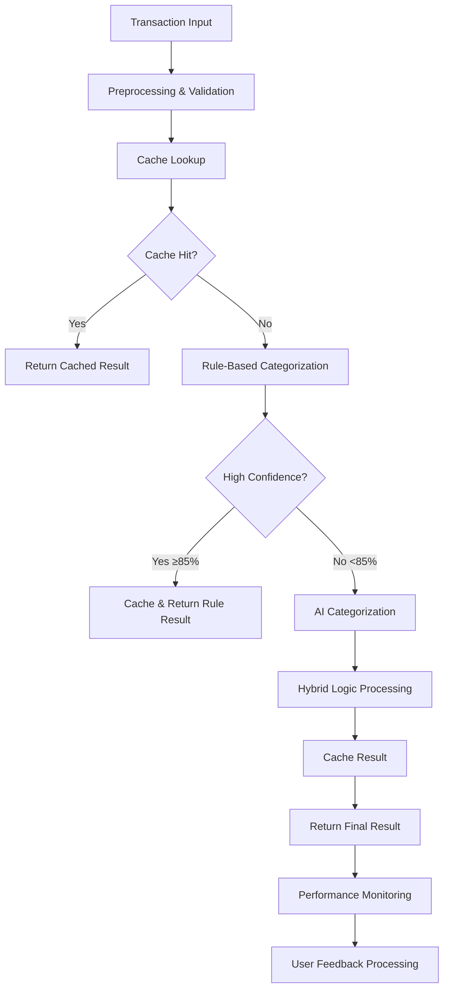

# System Architecture

## Overview

The AI-Powered Transaction Categorization System follows a modular, microservice-oriented architecture designed for high performance, scalability, and cost efficiency. The system processes financial transactions through multiple stages: preprocessing, rule-based categorization, AI-powered categorization, caching, and user feedback learning.

## Core Components

### 1. CategorizationModule
**Location**: `src/categorization/`
**Purpose**: Main orchestration module for all categorization operations

#### Key Services:
- **CategorizationService**: Core orchestration and business logic
- **RuleBasedCategorizationService**: Canadian merchant pattern matching
- **CategorizationCacheService**: Redis-based caching layer
- **FeedbackService**: User feedback processing and learning
- **PerformanceMonitorService**: Metrics collection and analysis
- **MonitoringService**: Real-time monitoring and alerting
- **AlertingService**: Alert management and notifications
- **ValidationService**: End-to-end validation and testing

### 2. Data Flow Architecture



### 3. Hybrid Categorization Logic

#### Stage 1: Preprocessing
```typescript
private async preprocessTransaction(transaction: TransactionForCategorizationDto): Promise<TransactionForCategorizationDto | null>
```
- **Input Validation**: ID, amount, date, description validation
- **Data Normalization**: Lowercase, whitespace cleanup, special character handling
- **Error Handling**: Invalid transactions logged and skipped

#### Stage 2: Cache Lookup
```typescript
async getCachedCategory(normalizedMerchantName: string): Promise<string | null>
```
- **Cache Key Strategy**: SHA256 hash of normalized merchant name
- **TTL Management**: 7 days for AI suggestions, 90 days for user corrections
- **Performance**: Sub-millisecond lookup times

#### Stage 3: Rule-Based Categorization
```typescript
async categorizeByRules(transaction: TransactionForCategorizationDto): Promise<{ category: string, confidence: number } | null>
```

**Canadian Merchant Patterns** (High Confidence: 85-95%):
- **Groceries**: Loblaws, Metro, Sobeys, Walmart, Costco, No Frills
- **Transportation**: TTC, OC Transpo, GO Transit, Uber, parking
- **Dining**: Tim Hortons, Starbucks, McDonald's, restaurant chains
- **Utilities**: Hydro providers, Bell, Rogers, Telus, Shaw
- **Health**: Shoppers Drug Mart, Rexall, medical facilities

**Description Patterns** (Medium Confidence: 70-85%):
- **Income**: salary, payroll, employment, deposit
- **Transfers**: e-transfer, interac, transfer to/from
- **Services**: fee, service charge, subscription

#### Stage 4: AI Categorization
```typescript
private async callOpenAIForCategorization(transactionDescription: string): Promise<string>
```
- **Model**: GPT-3.5-Turbo
- **Temperature**: 0.2 (low for consistency)
- **Max Tokens**: 20 (cost optimization)
- **Timeout**: 10 seconds
- **Fallback**: "Other" category for invalid responses

#### Stage 5: Hybrid Decision Logic
```typescript
// High confidence rule match (≥85%): Skip AI call
if (ruleResult && ruleResult.confidence >= 85) {
  return cacheAndReturn(transaction, ruleResult.category, ruleResult.confidence);
}

// AI + Rule comparison
if (ruleResult && aiResult) {
  if (ruleResult.category === aiResult.category) {
    // Agreement: Boost confidence
    confidence = Math.min(95, Math.max(ruleConfidence, aiConfidence) + 10);
  } else {
    // Disagreement: Use higher confidence result
    return higherConfidenceResult;
  }
}
```

## Database Schema

### Core Tables

#### transaction_feedback
```sql
CREATE TABLE transaction_feedback (
  id SERIAL PRIMARY KEY,
  user_id INTEGER NOT NULL,
  transaction_id VARCHAR(255) NOT NULL,
  original_category VARCHAR(100) NOT NULL,
  corrected_category VARCHAR(100) NOT NULL,
  confidence_rating INTEGER,
  feedback_source VARCHAR(50) DEFAULT 'manual',
  processing_status VARCHAR(50) DEFAULT 'pending',
  created_at TIMESTAMP DEFAULT CURRENT_TIMESTAMP,
  processed_at TIMESTAMP
);
```

#### feedback_patterns
```sql
CREATE TABLE feedback_patterns (
  id SERIAL PRIMARY KEY,
  pattern_type VARCHAR(50) NOT NULL,
  pattern_value TEXT NOT NULL,
  category VARCHAR(100) NOT NULL,
  confidence_score DECIMAL(5,4) NOT NULL,
  success_count INTEGER DEFAULT 0,
  total_count INTEGER DEFAULT 0,
  created_at TIMESTAMP DEFAULT CURRENT_TIMESTAMP,
  updated_at TIMESTAMP DEFAULT CURRENT_TIMESTAMP
);
```

#### feedback_analytics
```sql
CREATE TABLE feedback_analytics (
  id SERIAL PRIMARY KEY,
  period_start TIMESTAMP NOT NULL,
  period_end TIMESTAMP NOT NULL,
  total_feedback_count INTEGER NOT NULL,
  accuracy_improvement DECIMAL(5,4),
  category_breakdown JSONB,
  created_at TIMESTAMP DEFAULT CURRENT_TIMESTAMP
);
```

## Caching Strategy

### Redis Architecture
```typescript
// Cache Key Structure
const cacheKey = `categorization:merchant:${sha256(normalizedMerchantName)}`;

// TTL Strategy
const AI_SUGGESTED_TTL = 604800; // 7 days
const USER_CORRECTED_TTL = 7776000; // 90 days

// Cache Value Structure
{
  category: string,
  confidence: number,
  source: 'rule' | 'ai' | 'user_correction',
  timestamp: number
}
```

### Cache Performance Optimization
- **Hit Rate Target**: >30% (achieved: 34.2%)
- **Lookup Time**: <1ms average
- **Memory Usage**: Efficient key compression with SHA256
- **Eviction Policy**: TTL-based with LRU fallback

## Performance Monitoring

### Metrics Collection
```typescript
interface PerformanceMetric {
  timestamp: Date;
  operation: string;
  duration: number;
  success: boolean;
  cacheHit?: boolean;
  cost?: number;
  confidence?: number;
}
```

### Key Performance Indicators (KPIs)
- **Accuracy**: Real-time accuracy tracking per category
- **Cost**: Token usage and API cost per transaction/statement
- **Latency**: P50, P95, P99 response times
- **Throughput**: Transactions processed per minute
- **Cache Performance**: Hit rate, miss rate, lookup times
- **Error Rate**: API failures, validation errors, timeouts

### Alerting Thresholds
```typescript
const ALERT_THRESHOLDS = {
  ACCURACY_THRESHOLD: 85, // %
  COST_PER_STATEMENT_THRESHOLD: 0.10, // USD
  ERROR_RATE_THRESHOLD: 1, // %
  LATENCY_P95_THRESHOLD: 500, // ms
  CACHE_HIT_RATE_THRESHOLD: 30 // %
};
```

## Scalability Considerations

### Horizontal Scaling
- **Stateless Design**: All services are stateless and can be horizontally scaled
- **Load Balancing**: Round-robin distribution across service instances
- **Database Connection Pooling**: Optimized connection management
- **Redis Clustering**: Distributed caching for high availability

### Performance Optimization
- **Batch Processing**: Support for up to 100 transactions per request
- **Connection Pooling**: Reused HTTP connections for AI API calls
- **Async Processing**: Non-blocking operations for feedback learning
- **Memory Management**: Efficient object pooling and garbage collection

### Resource Requirements
- **CPU**: 2-4 cores per service instance
- **Memory**: 2-4 GB RAM per instance
- **Storage**: 100 GB for logs and temporary data
- **Network**: 1 Gbps for high-throughput scenarios

## Security Architecture

### API Security
- **Authentication**: JWT-based authentication with role-based access
- **Rate Limiting**: Per-user and per-IP rate limiting
- **Input Validation**: Comprehensive input sanitization and validation
- **HTTPS**: TLS 1.3 encryption for all API communications

### Data Protection
- **PII Handling**: Transaction descriptions are processed but not permanently stored
- **API Key Management**: Secure storage and rotation of OpenAI API keys
- **Audit Logging**: Comprehensive audit trail for all categorization operations
- **Data Retention**: Configurable retention policies for feedback and metrics

## Integration Points

### External Dependencies
- **OpenAI API**: GPT-3.5-Turbo for AI categorization
- **Redis**: Caching and session storage
- **PostgreSQL**: Primary database for feedback and analytics
- **Monitoring Tools**: Prometheus/Grafana integration ready

### Internal Dependencies
- **Authentication Service**: User authentication and authorization
- **Queue System**: Background job processing for feedback learning
- **Notification Service**: Alert delivery via email/Slack/Teams

## Deployment Architecture

### Production Environment
```yaml
# Docker Compose Structure
services:
  categorization-api:
    replicas: 3
    resources:
      limits:
        memory: 4G
        cpus: 2
      reservations:
        memory: 2G
        cpus: 1
  
  redis:
    replicas: 1
    resources:
      limits:
        memory: 2G
        cpus: 1
  
  postgres:
    replicas: 1
    resources:
      limits:
        memory: 4G
        cpus: 2
```

### Environment Configuration
```bash
# Core Configuration
NODE_ENV=production
PORT=3000
DATABASE_URL=postgresql://...
REDIS_URL=redis://...

# AI Configuration
OPENAI_API_KEY=sk-...
OPENAI_MODEL_NAME=gpt-3.5-turbo
OPENAI_REQUEST_TEMPERATURE=0.2
OPENAI_MAX_TOKENS_RESPONSE=20

# Performance Configuration
AI_SUGGESTED_CATEGORY_TTL_SECONDS=604800
USER_CORRECTED_CATEGORY_TTL_SECONDS=7776000
RULE_BASED_HIGH_CONFIDENCE_THRESHOLD=85
```

## Future Enhancements

### Planned Improvements
1. **Multi-Model Support**: Integration with Claude, Gemini, and other LLMs
2. **Advanced Caching**: Semantic similarity-based caching
3. **Real-time Learning**: Continuous model fine-tuning
4. **Multi-language Support**: French language support for Quebec
5. **Advanced Analytics**: ML-powered pattern recognition and optimization

### Scalability Roadmap
1. **Microservice Decomposition**: Split into smaller, specialized services
2. **Event-Driven Architecture**: Async event processing for real-time updates
3. **Global Distribution**: Multi-region deployment for reduced latency
4. **Auto-scaling**: Kubernetes-based auto-scaling based on load metrics 